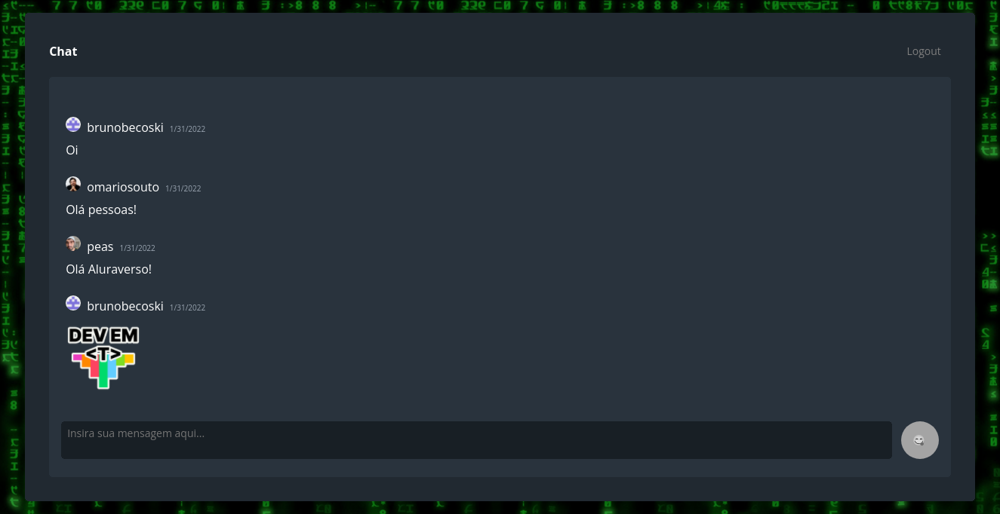

  

 

  <a href="sobre">Sobre</a> 
  &nbsp;&nbsp;|&nbsp;&nbsp;
  <a href="#tecnologias">Tecnologias</a>

 
 

  
  

## Sobre 
Projeto baseado no Discord usando o Supabase como banco de dados real time, criado na Imersão React 4 da @alura-cursos.

## Tecnologias
- [Next.js](https://nextjs.org)
- [SkynexUI](https://storybook.skynexui.dev)
- [Supabase](https://supabase.com)
